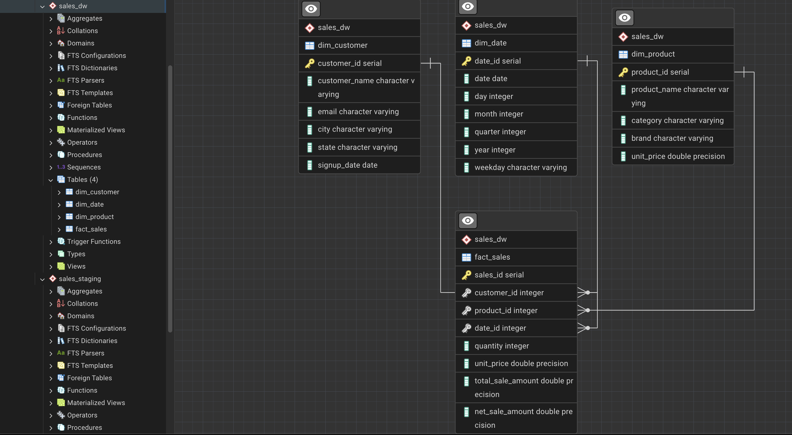

<!-- Improved compatibility of back to top link -->
<a id="readme-top"></a>

<br />
<div align="center">

<h3 align="center">Sales Data Warehouse – End-to-End ETL Pipeline</h3>

<p align="center">
A production-style ETL pipeline that ingests raw sales data, validates and cleans it using Python, and loads analytics-ready data into PostgreSQL using a Star Schema.
<br />
<br />
<a href="#about-the-project"><strong>Explore the documentation »</strong></a>
<br />
<br />
</p>
</div>

---

<!-- TABLE OF CONTENTS -->
<details>
  <summary>Table of Contents</summary>
  <ol>
    <li>
      <a href="#about-the-project">About The Project</a>
      <ul>
        <li><a href="#built-with">Built With</a></li>
      </ul>
    </li>
    <li>
      <a href="#architecture">Architecture</a>
    </li>
    <li>
      <a href="#getting-started">Getting Started</a>
      <ul>
        <li><a href="#prerequisites">Prerequisites</a></li>
        <li><a href="#installation">Installation</a></li>
      </ul>
    </li>
    <li><a href="#data-validation--quality">Data Validation & Quality</a></li>
    <li><a href="#data-warehouse-model">Data Warehouse Model</a></li>
    <li><a href="#analytics--sql">Analytics & SQL</a></li>
    <li><a href="#performance--optimization">Performance & Optimization</a></li>
    <li><a href="#auditing--observability">Auditing & Observability</a></li>
    <li><a href="#roadmap">Roadmap</a></li>
    <li><a href="#contact">Contact</a></li>
  </ol>
</details>

---

## About The Project

This project implements a **production-grade end-to-end ETL pipeline** that ingests raw sales data, performs extensive validation and cleansing in Python, quarantines bad data, applies business transformations, and loads clean data into a **PostgreSQL data warehouse** using a **Star Schema**.

The pipeline is intentionally designed to mimic **real-world data engineering systems**, where data is messy, incomplete, and unreliable.

### Key Features

- Incremental ingestion using audit watermarking  
- Strong schema and data quality validation  
- Rejection and quarantine of bad data  
- Business-rule-driven transformations  
- Dimensional modeling (Star Schema)  
- SQL analytics-ready warehouse  
- Full audit and observability  

<p align="right">(<a href="#readme-top">back to top</a>)</p>

---

### Built With

* **Python**
* **Pandas**
* **SQLAlchemy**
* **PostgreSQL**
* **SQL**

<p align="right">(<a href="#readme-top">back to top</a>)</p>

---

## Architecture

**High-Level Flow**

* **Raw CSV Files**
* **↓**
* **PostgreSQL (sales_staging)**
* **↓**
* **Python ETL (Validation + Transformation)**
* **↓**
* **PostgreSQL (sales_dw)**

### Schemas

#### `sales_staging`
Raw, untrusted data stored exactly as received.

Tables:
- `customers_stage`
- `products_stage`
- `sales_transactions_stage`
- `etl_audit_log`

No transformations or constraints are applied here.

#### `sales_dw`
Clean, analytics-ready data stored in Star Schema format.

Tables:
- `dim_customer`
- `dim_product`
- `dim_date`
- `fact_sales`
- `etl_data_quality_report`

<p align="right">(<a href="#readme-top">back to top</a>)</p>

---

## ER Diagram

The following ER diagram represents the **Star Schema data model** used in the `sales_dw` schema.

<p align="center">
  
</p>

<p align="right">(<a href="#readme-top">back to top</a>)</p>


## Getting Started

### Prerequisites

- Python 3.9+
- PostgreSQL
- Virtual environment (recommended)

### Installation

1. Clone the repository
   ```sh
   git clone https://github.com/your_username/sales-data-warehouse-etl.git

2. Create and activate virtual environment
    ```sh
    python -m venv venv
    source venv/bin/activate

3. Install dependencies
    ```sh
    pip install -r requirements.txt

4. Configure database connection in .env

5. Run the pipeline
    ```sh
    python main.py

<p align="right">(<a href="#readme-top">back to top</a>)</p>

<a id="readme-top"></a>

## Data Validation & Quality

### Customer Validation
- Deduplication by `customer_id`
- Latest `signup_date` retained
- Null handling:
  - `email` → `unknown@example.com`
  - `city` → mode(city)
  - `state` → mode(state)
  - `signup_date` → current date
- Text standardization applied

### Product Validation
- Invalid product names rejected
- Deduplicated by `product_id`
- Price cleansing using `abs()`
- Missing `category` / `brand` filled using mode
- All text fields standardized

### Sales Validation
- Invalid dates rejected
- Orphan foreign keys rejected

### Quarantine Strategy
Rejected data is **never deleted** and is stored as **timestamped CSV files** for reprocessing.

<p align="right">(<a href="#readme-top">back to top</a>)</p>

---

## Data Warehouse Model

### Star Schema

#### Dimensions
- `dim_customer`
- `dim_product`
- `dim_date`

#### Fact
- `fact_sales`

**Fact Grain:** One row per sales transaction

<p align="right">(<a href="#readme-top">back to top</a>)</p>

---

## Analytics & SQL

### Example Analytics Supported
- Top 10 products by revenue
- Monthly sales trends
- Rolling 3-month averages
- Customer lifetime value (CLV)
- Revenue by category
- Weekday vs weekend sales
- Customer retention analysis

All queries are optimized using **indexes** and **window functions**.

<p align="right">(<a href="#readme-top">back to top</a>)</p>

---

## Performance & Optimization

### Python
- Fully vectorized Pandas operations
- No row-level loops
- Batch inserts using `method="multi"`

### PostgreSQL
- Indexes on foreign keys
- Analytical indexes on `date_id`
- Designed for future partitioning by date

<p align="right">(<a href="#readme-top">back to top</a>)</p>

---

## Auditing & Observability

### Audit Log
Tracks:
- Pipeline name
- Last processed ingest date
- Records processed
- Update timestamps

### Data Quality Report
Tracks:
- Records extracted
- Records rejected
- Records loaded

**Stored in:**


<p align="right">(<a href="#readme-top">back to top</a>)</p>